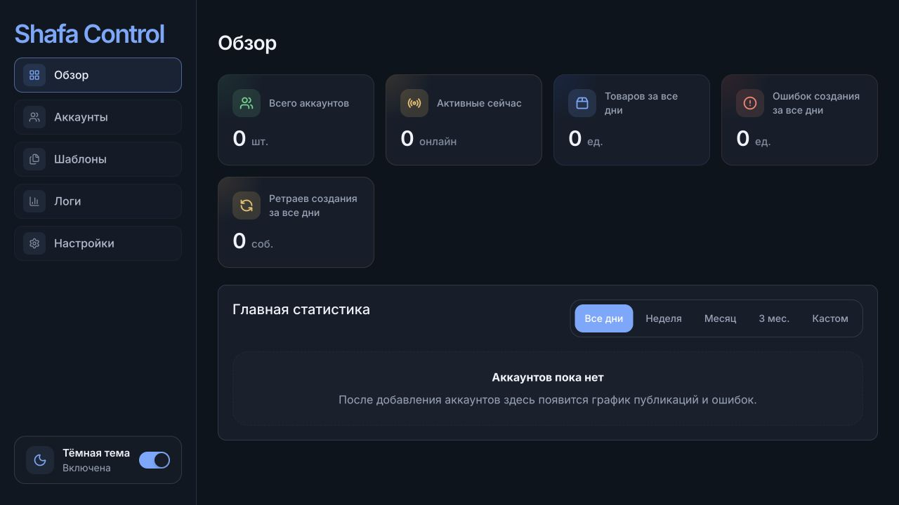
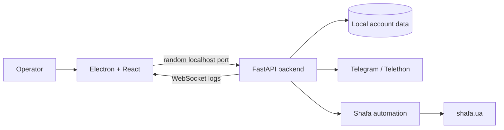

# Shafa Control

**A local desktop operations tool for sellers who need to manage multiple Telegram identities and turn channel content into structured product-publishing workflows for Shafa.**

[Source](https://github.com/eerinessofsilence/shafa) · [Setup & Operations](docs/setup-and-operations.md) · [Automation Docs](shafa_logic/README.md)



> **Status:** active, local-first automation project. Account management, authentication, templates, logs, and publishing foundations exist; third-party UI changes can still break browser automation.

## What it delivers

- Keeps multiple work accounts, Telegram sessions, and Shafa cookies separated.
- Guides Telegram and Shafa authentication from one desktop interface.
- Resolves per-account channel templates for repeatable product preparation.
- Collects Telegram content and media for downstream Shafa publishing flows.
- Shows dashboard metrics, account state, and live operational logs.
- Stores runtime data locally instead of requiring a hosted control plane.

## Data flow



## Quick start

```bash
git clone https://github.com/eerinessofsilence/shafa.git
cd shafa
python3 -m venv .venv
source .venv/bin/activate
pip install -r requirements.txt
cd desktop-ui
npm install
npm run dev
```

Electron should open the dashboard and start the FastAPI backend automatically. Add account credentials through the app before using Telegram or Shafa actions. See the [operations guide](docs/setup-and-operations.md) for environment variables, storage paths, builds, and troubleshooting.

## Tests, security, and limitations

```bash
source .venv/bin/activate
python -m unittest discover -s tests -p "test_*.py"
python -m unittest discover -s shafa_logic/tests -p "test_*.py"
cd desktop-ui && npm run typecheck && npm run build
```

- Sessions, cookies, phone numbers, and credentials are sensitive local data; never commit runtime files or `.env` values.
- Use only accounts and content you are authorized to operate, and respect Telegram and Shafa terms and rate limits.
- Browser automation depends on third-party markup and may require maintenance after site changes.
- Packaging, automatic updates, encrypted-at-rest local storage, and an external security audit are not included yet.

## License

The repository is public for portfolio and evaluation purposes. No open-source license is currently included.
